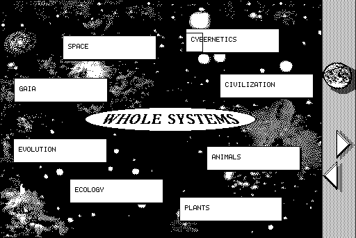

<div align="center">

# 🖥️ macrecomp

**Drop-in classic Macintosh for your static recompilation project.**

```
   68k CODE resources                     Your recompiled C
   from a 1980s Mac app                   (one function per 68k sub)
          │                                       │
          │  extract · disassemble · lift         │  calls Toolbox traps
          ▼                                       ▼
   ┌──────────────────────────────────────────────────────┐
   │                     macrecomp                          │
   │   m68k CPU state · A5 world · resource mgr · QuickDraw │
   │   Event/Menu/Window/Dialog Mgr · Sound Mgr             │
   └──────────────────────────────────────────────────────┘
          │
          ▼
   SDL2 window + audio
```

*The System 6/7 Toolbox, chopped into a linkable C library — so you never reverse-engineer QuickDraw twice.*

</div>

---

## What is this?

Static recompilation takes an old program's machine code and turns it into
native C that runs today. For a console game the hard part is the *hardware*
(that's what [snesrecomp](https://github.com/sp00nznet/snesrecomp) provides). For
a **classic Macintosh** application the hard part is the **Toolbox** — the ~1000
ROM/System traps every Mac app calls for graphics, windows, menus, events and
sound.

Every 68k Mac app draws through QuickDraw, pumps `GetNextEvent`, and plays
sound through the Sound Manager. So why reimplement that for every recomp?

**macrecomp** packages the pieces a lifted 68k Mac app needs — a small m68k CPU
state model, the A5 world + segment/jump-table loader, a resource-fork manager,
and a growing HAL that maps Toolbox traps onto **SDL2** — as a linkable library
plus the tooling to get you there. This is the same "chop the platform into
libraries, let each game link against them" approach as N64Recomp and snesrecomp,
aimed at the Mac.

It is the sibling of the x86/DOS [pcrecomp](../tools) toolkit, for 68k + Toolbox
instead of 8086 + DOS INTs.

## The pipeline

```
  App (HFS resource fork: CODE 0..N + PICT/snd/ASND/MENU…)
        │  ① extract     tools/extract_resources.py   (dc42/HFS/CD → CODE + assets + inventory.json)
        ▼
  CODE segments + asset catalog
        │  ② disassemble  tools/disasm_code.py         (capstone M68K)
        │  ③ classify     tools/scan_traps.py          (enumerate A-line Toolbox traps  ← the scope gate)
        ▼
  function table + trap set
        │  ④ lift         tools/lift68k.py             (68k → C against the macrecomp runtime)
        ▼
  C source ──⑤ HAL──▶  QuickDraw→SDL2, traps→runtime ──⑥ build──▶ native app
```

Steps ①–③ are cheap and tell you the real cost of a title *before* you commit to
it: the **trap set** from ③ is exactly the Toolbox surface you must implement.

## Status

🚧 **v0 — tooling first.** The dig tools are real; the runtime HAL grows per game.

| Component | What it does | State |
|-----------|--------------|-------|
| `extract_resources.py` | DiskCopy 4.2 / raw HFS / partitioned Mac CD → CODE segments, asset catalog, `inventory.json` | ✅ working |
| `disasm_code.py` | capstone-M68K disassembly, annotated with traps + A5 jump-table calls | ✅ working |
| `scan_traps.py` | enumerate A-line (`$Axxx`) Toolbox traps; parse the CODE 0 jump table; `--coverage` scores them against the HAL | ✅ working (validated on Finder, Shufflepuck, HyperCard) |
| `traps.json` | 1177 trap word↔name mappings (Inside Macintosh) for the two tools above | ✅ |
| `pict2png.py` | decode 1-bit QuickDraw PICT (v1) resources → PNG (BitsRect/PackBitsRect) | ✅ |
| `unprotect.py` | statically unpack self-decrypting/protected CODE | ✅ **fully solved** (jump table + segment bodies, byte-exact) |
| `relocs.py` | read THINK C far-model `CREL`/`DREL` relocations; mark which longwords in a segment are data addresses | 🟢 CREL confirmed against string starts; DREL in-range only |
| `ghidra/EmuDecrypt.java` | run an isolated decrypt routine in Ghidra's p-code emulator (the oracle for cracking an unknown cipher) | ✅ |
| `lift68k.py` | mechanical 68k → C lifter (per-function; branches→goto; traps→HAL); every instruction is an entry point, so computed jumps into a function resolve; rejects function starts that are provably not code; `--entry 0x...` adds a boundary the decode cannot find on its own, which a *computed* entry never is -- `tools/find_entries.py` finds the addresses to pass -- see ROADMAP | ✅ **97–100% instruction coverage** |
| `conformance.py` | extract → scan → coverage over the corpus; one row per title, fails on a drop below baseline | ✅ in CI |
| `extract_resources.py --forks` | every file's data + resource forks, plus `files.json` — what the File Manager HAL serves | ✅ |
| runtime `m68k.{h,c}`: CPU state + big-endian memory + faithful CCR flags + function table/dispatch | the execution substrate | ✅ |
| runtime `quickdraw.c` + `platform_sdl.c`: 1-bit framebuffer + pen/rect/line/oval/text/CopyBits → SDL2 window | the video HAL | ✅ core (self-tested) |
| runtime `toolbox.c`: A-trap dispatch, Resource Mgr (serves the app's resources), QuickDraw incl. **CopyBits + DrawPicture + regions**, Window/Menu/File stubs, Memory Mgr heap | the OS HAL | 🟢 ~190 traps; boots real games |
| runtime `dialog.c`: **Dialog + Control Manager** — DITL parsing, ModalDialog, ParamText, ControlRecords | dialogs and buttons | 🟢 working (self-tested) |
| runtime `font5x7.h` | original 5×7 bitmap font for the QuickDraw text primitives | ✅ fixed-pitch stand-in |
| entry-point dispatch (enter a lifted function at an interior address) | needed for register-indirect jumps | ⬜ **next** |
| Sound (ASND) · full Menu/Dialog interaction | | ⬜ |

### Measured scope

`scan_traps.py --coverage` scores a title's trap set against the HAL, so the
cost of a title is a number before any of it is lifted:

| Title | 68k | CODE segs | Distinct traps | Call sites | Sites covered |
|---|---|---|---|---|---|
| Shufflepuck Cafe (1988) | ~53 KB | 6 | 182 | 995 | **92%** |
| HyperCard 1.2.2 (1988) | 326 KB | 22 | 418 | 3166 | **83%** |

```bash
python tools/scan_traps.py work/unpacked --coverage runtime/toolbox.c
```

`tools/conformance.py` runs that measurement over the whole corpus in CI and
fails the build if a title's covered-site count drops below its recorded
baseline. Corpus images are copyrighted Mac media and live outside the repo, so
a missing title reports `SKIP` rather than passing quietly:

```bash
MACRECOMP_CORPUS=/path/to/images python tools/conformance.py
```

First customer: [**shufflepuck-cafe**](https://github.com/sp00nznet/shufflepuck-cafe)
(Broderbund, 1988) — 6 CODE segments, ~53 KB of 68k, B&W QuickDraw.

**HyperCard boots.** All 21 CODE segments lift at 97-100% instruction coverage,
a whole run hits only two unimplemented instructions, and it executes ~305
Toolbox calls: the full init sequence (InitGraf/InitFonts/InitWindows/TEInit/
InitDialogs), then its own resources.

**And it works.** It opens a stack off the disc, compiles and runs the card's
HyperTalk, paints the card — artwork included, all 342 rows of it — and
follows a click to the next card. The screenshot below is a real frame.

Three faults stood between booting and that, and not one of them was specific
to HyperCard:

- **An indirect jump into the middle of a function.** Lifted functions now
  take an entry address and label *every* instruction, and the runtime finds
  the function whose body *covers* an address rather than only the one that
  starts at it. Not one mid-function jump fails in a whole run.
- **`adda.w`, `suba.w` and `cmpa.w` read their source as a longword** and
  then truncated it, which keeps the *low* half — the word two bytes past
  the one addressed. 56 call sites. HyperCard's bitmap decoder finds the end
  of the row it is filling that way, so it judged every row short and left
  the bottom third of every card blank.
- **A busy-wait on `Ticks` with no clock**, below.

Finding the third meant finding a loop that made no traps, no calls and no tail
jumps. Every loop goes round a *backward branch*, so the lifter now emits a hook
there; one address took 19,999,889 of 20,000,000 ticks, and it was a busy-wait
on the low-memory `Ticks` global — HyperCard calibrating machine speed. The
runtime only advanced `Ticks` from `m68k_call`, and that loop makes no calls, so
the wait could only be infinite. The same hook now advances `Ticks` every 2048
backward branches, which fixes the whole class: every classic-Mac timing
busy-wait needs it. [ROADMAP.md](ROADMAP.md) has the disassembly, the debugging
switches, and what is still stubbed (SANE, and a title's own `XCMD`/`XFCN`
code, which never reaches the lifter).

HyperCard was the target on purpose. It is one 68k `APPL`, and recompiling it
makes every HyperCard stack reachable at once rather than one title at a
time — which is why the stack repos that consume it stay nearly empty.

## Screenshot



HyperCard 1.2.2 recompiled to C, drawing a card from The Electronic Whole Earth
Catalog (Broderbund, 1988) into a 512×342 1-bit framebuffer. Everything here is
the title's own work: it mounted the disc image, found and opened the stack,
decompressed the card's bitmap, laid out and drew the text, and got to this
card by following a click from the catalog's table of contents. Real output,
not a mockup.

The same card rendered as white with eight empty boxes until the `adda.w`
operand-size fix above; the artwork is what the bitmap decoder was giving up
on two thirds of the way down.

## Using macrecomp in your project

Add it as a submodule (this is how the game repos consume it):

```bash
git submodule add https://github.com/sp00nznet/macrecomp.git ext/macrecomp
```

```cmake
# In your game's CMakeLists.txt:
add_subdirectory(ext/macrecomp)
target_link_libraries(my_recomp PRIVATE macrecomp SDL2::SDL2main)
```

Extract a title's resources to start digging:

```bash
python ext/macrecomp/tools/extract_resources.py "MyGame.dc42" -o work/
# → work/code/CODE_0.bin … CODE_N.bin, work/inventory.json, work/assets/…
```

## Repo layout

```
macrecomp/
  tools/      extract / disasm / scan-traps / lift  (the dig kit, Python)
  runtime/    the linkable C library — m68k state, A5 world, Toolbox HAL → SDL2
  include/    public headers (macrecomp/*.h)
  docs/       ARCHITECTURE.md and trap-mapping notes
  examples/   minimal harnesses
```

## Credits & prior art

- **[macresources](https://github.com/tashtego/macresources) + [machfs](https://github.com/tashtego/machfs)** by Elliot Nunn — pure-Python HFS + resource-fork parsing. The extractor stands on these.
- **[capstone](https://www.capstone-engine.org/)** — M68K disassembly.
- *Inside Macintosh* (Apple, 1985–) and the open-source **[Executor](https://github.com/autc04/executor)** clean-room Toolbox — reference semantics for the trap HAL. No Apple ROM or code is used or redistributed here.
- Approach borrowed from **[N64Recomp](https://github.com/N64Recomp/N64Recomp)** and **[snesrecomp](https://github.com/sp00nznet/snesrecomp)**.

## License

MIT — see [LICENSE](LICENSE). The toolkit is original work. It ships **no** Apple
ROM, System software, or copyrighted game data — you bring your own copy of
whatever you're recompiling.

The screenshot is a single frame of a recompiled program running, included to
show what the toolkit does. HyperCard is © Apple Computer; The Electronic Whole
Earth Catalog is © 1988 Broderbund Software, and the Whole Earth Catalog and
its contents © Point Foundation and the respective authors. No code or data
from any of them is in this repo.
